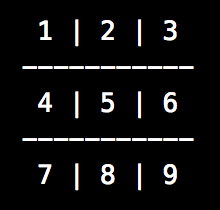

# TDD Tic Tac Toe

This JavaScript program was built through a focus on Test Drive Development. Using the built-in CLI Readline module, the program can be played in your terminal or command console! The rules of Tic Tac Toe are as follows:
  1. Player X makes the first move, followed by Player O.
  2. There are only 9 spaces where you can place your designated token.
  3. The first player to place their token three in a row wins the game.
  4. In the event players fill the board without a winner, it's a draw.

## Installation

To begin, fork this repository and clone it into your local drive. Once you clone it, open up your terminal/command line and CD into the folder, enter ```node ticTacToe``` to begin playing!

## Using the Application

#### Tic Tac Toe

The limitation to this game is that all player inputs must be valid numbers from 1-9. When playing the game, you are shown a board like this:



Enter the number on the grid where you want to place your token. If there is a winner or the game ends in a draw, the program will end. If you wish to continue playing, restart the program with ```node ticTacToe```

<!-- Insert a gif of the user login page -->
